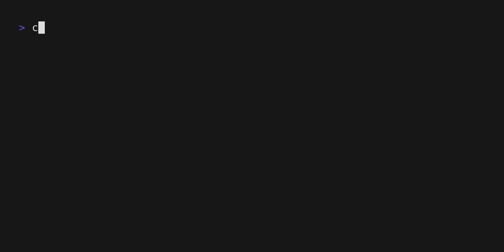

# Checkup

Checkup is a simple utility that will perform a series of code quality checks & tests on a go package

## Checks

Checkup will run the following checks:

- `go fmt` - WIP
- `go vet`
- `go test`
- `gosec` 
- `staticcheck`

## Failed checks

If a check fails, it will be shown in the summary table, with a detailed response below.
At the time of writing, the detailed response will be from `stderr`

## Theming

Checkup uses a 16bit ANSI color scheme, which will adapt to your terminal theme of choice. I personally like [catppuccin](https://catppuccin.com)